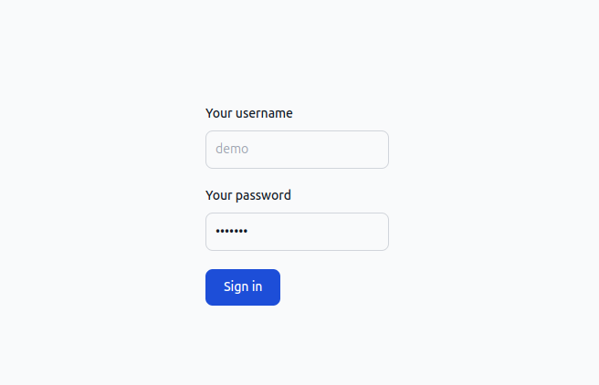
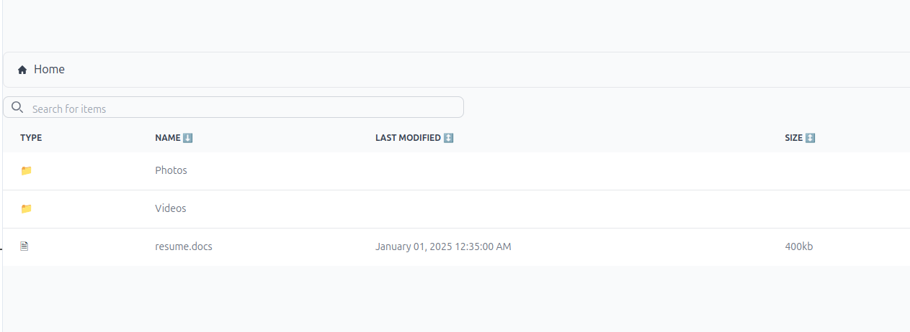
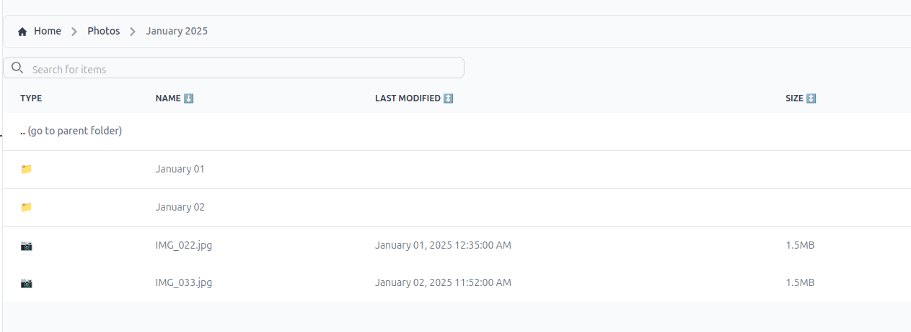
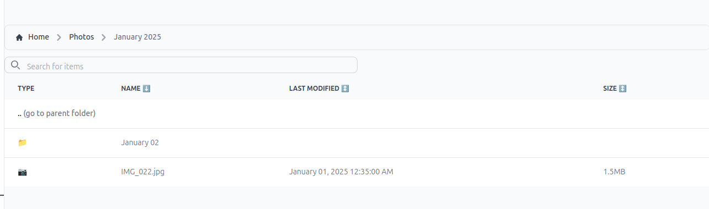
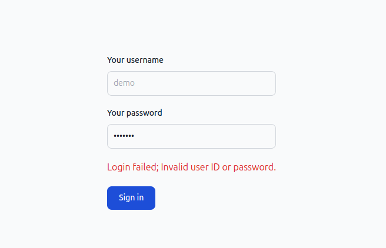

| authors | Dmytro Bondarhuk |
| --- | --- |
| state | draft |

# RFD 0 - Filebrowser

## What

The goal of this project is to create a MVP of Filebrowser to allow users navigate through the directory / file structure.

## Why

We want to provide a file managing interface within a specified directory (initially) and it can be used to upload, delete, preview, rename and edit your files (post-MVP stage)

## Details

### UX

The initial goal of this project is to allow users browse the contents of the application working directory (we will refer it to as **root** directory) when they have been given access (no unauthorized access is allowed).

Following user scenarios can be used to create initial tasks scope:

#### Example 1: Alice wants to check if all required files are been uploaded correctly into appropriate directories

Alice is the employee of the company that has been given access to this application to check if all company photos were uploaded and sorted by year, month, and day into appropriate directories. The application root directory is pointed to the company share folder.

First Alice will open the browser (desktop and mobile devices are supported) and then open the application URL.

As she is not yet authenticated she will be prompted to provide her credentials (username and password) into the sign in form.

  
Pic 1: Sign in form


Once she has been successfully authenticated, she is redirected to the table like view of root directory which will list all folders and files in there. Each view will have following columns: Type (file/directory), Name, Last modified date (for files), Size (only for files in human readable format)

  
Pic 2: Root folder view

Alice will be able to click on the `Photos` directory to be redirected to the view having `Photos` directory content.

  
Pic 3: Photos directory content view

After that she will be able to navigate between folders containing photos sorted by month and years in order to check the files they are containing. 

If the amount of files in the directory is large, Alice will have the ability to filter files and subdirectoris by typing the partial name into the search box to be able to see only files and subfolders of the current directory that contain the filter input, ignoring the casing.

  
Pic 4: Filtered folder view

If Alice wants to see content to have files be first sorted by last modified date, size or name (default for both directories and files), she can click on the respective column header to sort either by ascending or descending order.

In order to navigate back to parent folder Alice can click on the parent folder name in the breadcrumb-style navigation bar above the main view or click `..` row for all non-root paths.

In case Alice refreshes the page browser page to check for the new files uploaded, she is able to view the same folder as before refresh.


#### Example 2: Bob tries to sign in and his account doesn't not exist / he provided wrong credentials

Bob tries to check photos and opens the application. In the sign in form he mistyped his password and he will be given error message saying that his credentials are invalid. The error message won't mention if account doesn't exist or his password is incorrect to prevent password guessing by bad actors


  
Pic 5: Invalid credentials were provided

#### Example 3: Charlie wants to sign out of the application when he leaves his public use computer

Charlie is using shared computer and wants to prevent other people viewing the company's shared folder with out authorization. After he is done with his work, Charlie is able to click a sign out button to remove his session with application


### UI

We will build our UI app using React with Typescript. For styling our app Tailwind CSS will be used in order to speed up the development and use declerative styling.

#### Pages / Views

Following pages/views should be created for our MVP:

1. Sign in page - for MVP it will be a simple form with username/password and sign in button. Once user is signed in, they will be redirected to directory view

2. Directory view page - main page of the application with following components:
    1. Folder structure breadcrumbs
    2. Buttons for creating folder and uploading file. Each should launch respective modal popup dialog.
    3. Input to support filtering folder contents
    4. Table with folder contents and following columns: Type, Name, Size, Last modified date. User should have an ability to sort by all columns (except the type which should first sort. For example if user has sorted by name, first all directories should be sorted by name and then all files).  
    If the current folder is not a root, first row in table should be `..` to add navigation to parent folder.  
    If the folder contents is still loading, "Loading..." message should be displayed and all the controls should be disabled 
    5. Sign out button - after sign out user should be redirected to sign in form

3. 404 page

#### UI URL navigation

We can leverage React router to support user URL navigation stored inside the browser history and persisting view of the same folder on browser page refresh.

Example: 
1. `/contents` - will get the root folder contents
2. `/contents/photos` - will get contents of folder called `photos`

If path is not found, user should be redirected to the 404 page.

If path is a file, in MVP we can show the info about the file.

If user tries to access the contents page while not authenticated, they will be redirected to the sign in page. If during their session, their authorization expires, they will redirected to the sign in page.

Another important thing to keep in mind is possible characters in folder names. Those are `< (less than), > (greater than), : (colon), " (double quote), / (forward slash), \ (backslash), | (vertical bar or pipe), ? (question mark), and * (asterisk)`. We should validate for these characters in new / rename folder/file forms. But this also allows us safely treat `/` as folder separator in URLs.

Because using non-latin (letter with accents, cyrillic, hieroglyphs, etc.) characters in folder names and URL paths is allowed, this won't not make any problems for our application.

##### Storing filter/sorting state

1. Filtering - storing the filter query can be useful for users that are searching for a specific directory in a large list of subdirectories and after navigation to the required folder, use the browser navigation to go back. While it is not making big impact in the context MVP application, it can improve the overall user experience. For storing filtering state, a new query param could be used: `?search=photos`. This will also help for people who are sharing the link to show results.  
Worth mentioning, that while we can perform "search" on client instantly after each character is typed, URL should be only update once the filter input box loses focus (or at least using `useDefferedValue` in React) to prevent multiple entries in browser history.

2. Sorting - preserving sorting state can be help users who are familiar with OS file browser, to expect same sorting all over the directory structure. While the best option for this would be saving it as user prefernce in database (to give users same experience on all their devices), we can use leverage browser's localStorage in order to preserve the sorting prefernce.

#### Base React components structure

The basic layout of directory page could look like this:

```tsx
<Root>
    <UserInformation>
        <HelloUserName/>
        <SignOutButton/>
    </UserInformation>
    <Breadcrums>
        <Home>
        {path.split('/').map((p, index) => (<Breadcrumb path={p} isLast={index === path.split('/').length - 1}/>))}
    </Breadcrumbs>
    <div>
        <FilterInput/>
        <ButtonGroup>
            <CreateFolderButton/>
            <UploadFileButton/>
        </ButtonGroup>
    </div>
    <table>
        <thead>
            {columns.map(col => (<Column column={col} />))}
        <thead>
        <tbody>
            {loading && <LoadingMessage />}
            {path.length > 0 && <GoToParentButton/>}
            {folders.map(folder => (<FolderRow folder={folder}/>))}
            {files.map(file => (<FileRow file={file}/>))}
        </tbody>
    </table>
</Root>
```

#### UI gotchas

1. While we don't expect at MVP stage for users to have thousands of files and folders in one directory, in the production environment it would be a good idea to use something like [react-infinite-scroll-component](https://github.com/ankeetmaini/react-infinite-scroll-component) to make UI not render all the items at once.  
While implementing pagination is simpler in terms of development work, it will compromise user experience. Users are familiar with browsing directory contents in their OS file browsers, which all implement scrolling instead of pagination.

2. Max URL length - while folder structure can get very long, general max URL length is around 2048 characters. With average folder name being 15 characters + slash (16 characters in total), this should be enough for approximately 130 folders in depth

#### Authentication

As we are using `httpOnly` cookie for authentication purposes we do not need to store anything on the UI. 

If user doesn't have the cookie (or any HTTP request returned `401` status code) we should redirect user to the sign in page.

If user clicked the sign out button, once the request was successful, user redirected to the sign in page.

We can use non-`httpOnly` cookie passed from the sign in API route in order to facilitate the redirect to sign in page if it doesn't exist. This cookie should not contain any private information to prevent any bad actors from stealing it.

### Server side

#### API Routes

In order to support the above following API routes:

1. `GET /contents?/[[path]]` - Main API route to get contents of the folder.  
**Arguments**:  
`[[path]]` - **OPTIONAL** path to the folder relative to the root directory. If empty, root directory content is returned. Folders are separated by `/` slash sign
**Returns**:  
`404`: Path not found  
`401`: Unathorized  
`200`: Folder contents using JSON in following format:  
```json
{
  "name": "example",
  "type": "dir",
  "contents": [
    {
      "name": "README.md",
      "type": "file",
      "size": 12345,
      "lastModified": "2025-01-06T21:45:49.076Z"
    },
    {
      "name": "images",
      "type": "dir"
    }
  ]
}
```  

Which can be translated in the following TS type:  
```typescript
export type Response = {
    name: string;
    type: 'dir';
    contents: ({
        name: string;
        type: 'file';
        size: number;
        lastModified: Date;
    } | {
        name: string;
        type: 'dir'
    })[]
}
```

2. `POST /auth/signin` - Authorizes user and returns a token  
**ANONYMOUS ROUTE**  
**Arguments**:  
*Body* -  JSON file:  
```json
{
    "username": "username",
    "password": "password"
}
```

**Returns**:  
`401`: Unathorized  
`400`: Malformed request object
`200`: User was successfully authorized and is provided with `httpOnly` cookie for authentication purposes and basic cookie to indicate that user is authenticated

3. `POST /auth/signout` - Removes user token from authentication  
**Arguments**:  
None  
**Returns**:  
`401`: Unathorized  
`204`: User was successfully unauthorized

### Authentication and Authorization

#### Authentication token

When user requests to get As we are using `httpOnly` cookie for authentication purposes we do not need to store anything on the UI, a new token will be genereated and appended to `httpOnly` cookie which will be used by the browser automatically.

The session token will be generated randomly. For our MVP we will store the map of tokens and user infromation (username, expiration time). On each request the session cookie will be validated against the map. The default expiration time for session can be set to 1 hour

Ideally, we want to add a cron job to clean up expired sessions from memory in order to preserve space (i.e. each minute remove tokens that are older than 1 hour).

Once user requests sign out, session cookie will be removed from the storage and sends empty cookie back to user to delete it.

#### User information source

For this MVP, we won't use any real database with user information.  
The following users will be hardcoded into the mock user information store:

1. Username `demo`, password `demo`

#### Roles and permissions

In our MVP we won't have any different roles and permissions for different users. Each user will have access to the same folder.

### Security

#### SSL/TLS

In order to protect our API and user credentials/tokens, we need to set up SSL support for the webserver (we will be using TLS 1.3 with AES256). 

We will use bult in support for SSL in HTTP module:
```go
http.ListenAndServeTLS(":443", "full-cert.crt", "private-key.key", nil)
```

We will use self-generated SSL certificate for our MVP which should be replaced with real certificate on production, ideally provided by some managment tool to support easy rotation.

#### CORS

As in our MVP, the webserver will be serving both API and UI on the same port, we may not experience CORS problem. But as our product will grow, we will need to configure our webserver to support only specific URLs for the CORS (i.e., dev, product environments).

#### Storing user credentials

Ideally, we want to store user information in a database with passports hashed to prevent stealing of the user credentials. In our MVP, we will opt in to use hashed passwords stored in environment variables. These password will be hashed with `bcrypt` using random salt (provided via environment variable) for easy verification against credentials. 

#### DDOS, brutforce, and other attacks

One of the big problems that our app can expect would be a brutforce password guessing. To prevent this, some kind of rate limiter or max attempts with time locking can be added in future releases.

#### XSS/Injections/CSRF etc

While our won't have a lot of inputs in MVP stage, which are not supposed to be stored in database, file system etc., we can say that our application don't need to worry **AT THIS STAGE**. As we don't provide options to view files and directory names can not contain symbols that will allow someone to create a folder with name that can possibly execute JS on the client.  
Also, because our application doesn't support any mutations for MVP
In later stages, when renaming / deleting will be added, the possibility of CSRF attack should be mitigated.

#### Dependencies

All dependencies should be monitored for known vulnarabilities and updated accordingly.

#### Accessing files outside of scope

One of the security access problems that the appication can face is bad actors gaining access to folders and files that are parent to the root directory. This can happen if `..` is used as part of the path. For example, if Alice tries to open following url `/contents/photos/../..` she can access the parent folder for the root directory.

To prevent such attacks, following strategies could be implemented:

1. Disallow usage of `..` in path at all - we can return `400` status code if we find the part of the path that contain `..`, even if it's still allowed path

2. Calculating result path to check if it is outside of the root folder.

In the MVP stage we will not allow usage of the `..` completely as from UX standpoint it doesn't bring any value.

Another "reserved" path value is `.` (current directory). While it is not supposed to allow bad actors gain access to forbidden directory, it also doesn't bring any UX value and as so we can also deny its usage.

### Privacy

While our application won't have much of personal information, one of the important section is logging. While we will be using console for logs, we need to make sure that logs don't contain any PII (usernames, file names, etc.)

### Observability

While our application is limited in features, ideally we want to keep track of its performance and stability. For MVP stage one of the option would be to use console to record total request duration time, request time, and output any encountered erros (i.e. path that doesn't exist)

### Storage

For this MVP, we will work only with file system based storage. In order to support scalability we will create following interface:

```go
type Storage interface {
    contents(path string) []Item
}
```

This will allow us to switch between storage backends with ease in later stages.